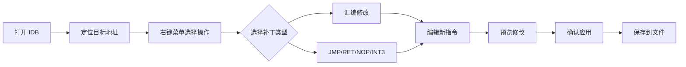

# IDAQ6

<div align="center">


[功能特性](#-功能特性) • [安装方法](#-安装方法) • [使用指南](#-使用指南) • [快捷键](#-快捷键) • [开发说明](#-开发说明)

</div>

**IDA-Pat，一款强大的 IDA Pro 二进制补丁插件**

---

## 📖 简介 Intro

**IDA-Pat** 是一款专为【逆向工程师】和【安全研究员】设计的 IDA Pro 插件，提供直观、高效的二进制文件补丁功能。通过友好的图形界面支持，让您能够轻松修改和分析二进制程序。

### 💡 亮点 Sight

- 🎯 **可视编辑** - 提供代码视图和字符串视图双模式编辑
- ⚡ **实时预览** - 修改前后对比一目了然
- 🔧 **多架构支持** - x86/x64, ARM, MIPS, PPC, SPARC, SystemZ
- 💾 **智能保存** - 自动备份原文件，支持快速应用补丁
- 🎨 **语法高亮** - 补丁位置智能标记，方便定位

---

## ✨ 功能

### 🔹 核心功能

#### 1. **汇编补丁 (Assemble)**

- 支持在反汇编视图中直接修改指令
- 自动识别代码和数据区域
- 智能检测字符串类型 (ASCII/UTF-16LE)
- 提供代码模式和字符串模式两种编辑器

#### 2. **快捷填充**

- **JMP (跳转)** - 强制条件跳转变为无条件跳转
- **RET (返回)** - 用 `0xC3` 填充，剩余部分填充 `INT3`
- **NOP (跳过)** - 用 `0x90` 填充选中区域
- **INT3 (中断)** - 用 `0xCC` 填充，常用于断点或禁用代码

#### 3. **补丁管理**

- **撤销 (Revert)** - 还原被修改的字节到原始状态
- **保存 (Save)** - 将补丁应用到可执行文件
- **快速保存 (Quick Save)** - 使用上次的设置快速应用补丁

#### 4. **图标导航**

- 在反汇编窗口中显示补丁状态图标
- 快速浏览所有补丁位置
- 支持前后导航

### 🔹 支持的处理器架构

| 架构 | 支持状态 |
|------|---------|
| x86/x64 | ✅ 完整支持 |
| ARM/ARM64 | ✅ 完整支持 |
| MIPS | ✅ 完整支持 |
| PowerPC | ✅ 完整支持 |
| SPARC | ✅ 完整支持 |
| SystemZ (s390x) | ✅ 完整支持 |

---

## 📦 配置 Setup

### 依赖 Depends

- **IDA Pro**: 7.6 或更高版本
- **Python**: 3.x (IDA 内置)
- **Keystone Engine**: 用于汇编指令 (已包含在插件中)

### 安装 Install 

**方式一：手动安装**

1. 复制以下内容对应的文件：

```
plugins/core/*         # 核心模块 (必需)
plugins/pate.py        # 主插件文件 (必需)
plugins/icop.py        # 图标预览插件 (可选)
```

2. 粘贴到 IDA Pro 的`plugins`目录：

```
*where your IDA*/plugins/
```

3. 重启 IDA Pro

**方式二：放弃安装**


---


## 🚀 使用 Usage

### 基础流程 Basics



### 详细步骤

#### 1️⃣ 修改指令

**方法一：右键菜单**
1. 在反汇编窗口中右键点击目标指令
2. 选择 `Edit` → `Patch program` → `汇編`
3. 在弹出的编辑器中输入新指令
4. 点击"确定"应用修改

**方法二：快捷键**
1. 选中目标指令
2. 按下默认快捷键 (无，可在配置中设置)
3. 输入新指令并确认

#### 2️⃣ 使用快捷填充

在反汇编窗口右键菜单中可以选择：
- **进之 (JMP)** - 强制跳转
- **返之 (RET)** - 替换为返回指令
- **进之 (INT3)** - 填充中断指令 (`Ctrl+I`)
- **过之 (NOP)** - 填充空指令 (`Ctrl+N`)

#### 3️⃣ 范围操作

所有填充指令都支持**范围选择**：
1. 在反汇编窗口中拖动选择多条指令
2. 右键选择相应操作
3. 插件会自动填充整个选中范围

#### 4️⃣ 保存补丁

**交互式保存：**
1. 右键菜单选择 `保留` (Save)
2. 在对话框中选择保存选项：
   - ✅ 应用补丁到文件
   - ✅ 创建备份 (.bak)
   - ✅ 清理备份文件
3. 选择输出路径
4. 点击"确定"

**快速保存：**
- 第一次保存后，可使用 `急留` (Quick Save)
- 使用上次的设置快速应用补丁
- 快捷键：无 (建议自定义)

---

## ⌨️ 快捷键

| 功能 | 默认快捷键 | 说明 |
|------|-----------|------|
| 汇编修改 | - | 打开汇编编辑器 |
| INT3 填充 | `Ctrl+I` | 用 0xCC 填充 |
| RET 填充 | `Ctrl+R` | 用 0xC3 填充 |
| NOP 填充 | `Ctrl+N` | 用 0x90 填充 |
| 撤销补丁 | - | 还原修改 |
| 保存补丁 | - | 打开保存对话框 |
| 快速保存 | - | 使用上次设置保存 |

💡 **提示**: 可以在 IDA 的快捷键设置中自定义这些快捷键

---

## 🎯 场景 Scene

### 🔍 场景 1：绕过验证

```assembly
; 原始代码
test eax, eax
jz   loc_invalid    ; 验证失败则跳转

; 修改方案 1：强制跳转到有效分支
jmp  loc_valid     ; 使用 JMP 补丁

; 修改方案 2：让条件永远满足
nop                ; 填充 JZ 指令
```

### 🔍 场景 2：禁用函数

```assembly
; 原始函数
push ebp
mov  ebp, esp
; ... 函数体 ...

; 修改方案：直接返回
retn               ; 使用 RET 补丁
```

### 🔍 场景 3：移除安全检查

```assembly
; 原始代码
call check_security
test eax, eax
jnz  loc_continue

; 修改方案：填充 INT3 禁用检查
int3               ; 使用 INT3 补丁
int3
int3
```

### 🔍 场景 4：修改字符串

```
原始："License expired"
修改："License valid  "  ; 使用字符串编辑器
```

---

## 🛠️ 开发说明

### 项目结构

```
plugins/
├── core/                      # 核心模块
│   ├── __init__.py           # 初始化
│   ├── actions.py            # IDA 动作定义
│   ├── asm.py                # 汇编引擎封装
│   ├── basic.py              # 基础工具类
│   ├── error.py              # 异常定义
│   ├── preview.py            # 补丁预览控制器
│   ├── preview_ui.py         # 预览界面
│   ├── save.py               # 保存控制器
│   ├── save_ui.py            # 保存界面
│   └── utils/                # 工具函数
│       ├── ida.py            # IDA API 封装
│       ├── misc.py           # 杂项工具
│       ├── python.py         # Python 工具
│       └── qt.py             # Qt 工具
├── pate.py                   # 主插件入口
├── icop.py                   # 图标预览插件
└── .gitignore                # Git 忽略配置
```

### 核心类说明

#### `Pat` 类 (pate.py)
主插件类，管理所有补丁相关功能：
- `assemble()` - 汇编指令
- `patch()` - 应用补丁
- `revert_patch()` - 撤销补丁
- `apply_patches()` - 保存到文件
- `nop_range()` / `int3_range()` / `retn_range()` - 快捷填充

#### `Act_*` 类 (actions.py)
IDA 动作处理器：
- `Act_Asm` - 汇编动作
- `Act_Jmp` - JMP 动作
- `Act_Ret` - RET 动作
- `Act_I_3` - INT3 动作
- `Act_NoP` - NOP 动作
- `Act_Rev` - 撤销动作
- `Act_Sav` - 保存动作
- `ActQSav` - 快速保存动作

### 添加新功能

1. 在 `core/actions.py` 中创建新的 action handler：

```python
class Act_Custom(ida_kernwin.action_handler_t):
    NID = 'pate:custom'      # 动作 ID
    NYM = "自定义"           # 菜单名称
    KEY = 'Ctrl+X'          # 快捷键
    TIP = "自定义功能说明"   # 提示文本
    ICO = 109               # 图标 ID
    
    def activate(ego, ctx):
        # 你的逻辑
        return 1
    
    def update(ego, ctx):
        return ida_kernwin.AST_ENABLE_ALWAYS
```

2. 在 `PLUGIN_ACTIONS` 列表中添加：

```python
PLUGIN_ACTIONS = [
    # ... existing actions ...
    Act_Custom,
]
```

3. 在 `_init_actions()` 中注册菜单项

### 调试技巧

启用插件热重载 (开发模式)：

```python
# 在 IDA Python 控制台中执行
import pate
reload(pate)
```

查看插件日志：

```python
# 输出到 IDA 输出窗口
print("[DEBUG] Your message here")
```

---

## ❓ 常問 Q&A

### Q: 为什么某些架构不支持？
**A:** 插件依赖 Keystone 引擎进行汇编。如果某个架构无法使用，请确认：
1. Keystone 是否已正确安装
2. 是否包含该架构的支持模块

### Q: 保存补丁时提示"无法找到干净的可执行文件"
**A:** 这通常发生在：
- 原始文件已被删除或移动
- IDB 是通过非标准方式创建的
- **解决方法**: 重新加载原始文件，或使用"保存"对话框手动指定源文件

### Q: 修改字符串后显示乱码
**A:** 可能是编码不匹配：
- ASCII 字符串应使用单字节字符
- Unicode 字符串应使用双字节 (UTF-16LE)
- 插件会自动检测，但可以手动切换编辑模式

### Q: 插件加载失败
**A:** 检查以下几点：
1. IDA 版本是否 >= 7.6
2. Python 版本是否为 3.x
3. 查看 IDA 输出窗口的错误信息
4. 确认插件文件权限正确

---

## 📝 更新日志

### v0.3.14 (2025.3.14)

- 🐛 修复某些情况下的汇编错误
- ✨ 改进 UI 快速响应模式
- 📚 更新文档

### v0.3.0

- ✨ 增强 UTF-16LE 字符串检测和编辑
- 🎨 优化图标

### v0.2.0
- ✨ 添加字符串编辑功能
- ✨ 添加`retn`和`int3`填充功能

### v0.1.0 [@Markus](https://twitter.com/gaasedelen)
- 🏗️ 初始版本
---

## 🤝 贡献指南

欢迎提交 Issue 和 Pull Request！

1. Fork 本项目
2. 创建功能分支 (`git checkout -b feature/AmazingFeature`)
3. 提交更改 (`git commit -m 'Add some AmazingFeature'`)
4. 推送到分支 (`git push origin feature/AmazingFeature`)
5. 开启 Pull Request

---

## 📄 许可证

本项目采用 **MIT 许可证** - 详见 [LICENSE](LICENSE) 文件

```
Copyright (c) 2025 E-C-Ares @ Are§tudю
```
```
Copyright (c) 2022 Markus Gaasedelen
```

---

## 👨‍💻 作者

- **E-C-Ares @Are§tudю**

---

## 🔗 相关链接

- [IDA Pro 官网](https://hex-rays.com/ida-pro/)
- [IDAPython 文档](https://python.docs.hex-rays.com/)
- [Keystone Engine](http://www.keystone-engine.org/)
- [逆向工程入门](https://github.com/MyKings/Reverse-Engineering)

---

## ⭐ 致谢

感谢 Hex-Rays 团队提供的优秀 IDA Pro 平台和 IDAPython 框架！

---

<div align="center">

**如果觉得有用，请给个 ⭐ Star 支持一下！**

Made with ❤️ by Are§tudю

</div>